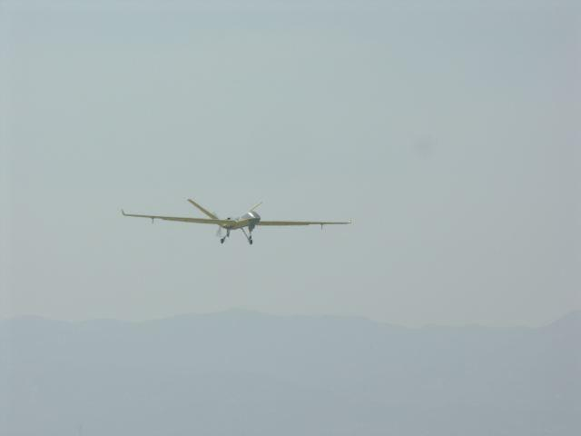

---
title: Driving Exam
date: 2017-02-28 10:40:20
tags:
---

科一口诀：

[科目一交规考试口诀](http://wenku.baidu.com/link?url=vzZx3NmlsbKHb9NdilH3_v51de_3_HUASRAqm6DVpFS4lOaRoqklSCU2lP1jR-GiRKXCPr357YgS-eH9l3RZVvhUEkTf4TEaxr_QxoslS8a)
[科目一考试速记口诀](http://jingyan.baidu.com/article/84b4f565cc5aff60f6da32f4.html)

<!--more-->

1 错车道和紧急停车带的区别
	
	

2 处200元以上2000元以下罚款的有：

3 因逃逸致人死亡的处7年以上，造成死亡并且逃逸的处3到7年，造成死亡的处3年。

4 驾驶人在驾驶证有效期满前90日内申请换证。

5 交替使用远近光灯：夜间通过急弯，坡路，拱桥，人行横道，或者没有交通信号灯控制的路口时。

6 高速能见度为200米，100米，50米的的速度分别为：
	能见度小于200m时，车速60，车距100
	能见度小于100米时，车速40，车距50
	能见度小于50m时，车速20，尽快驶离高速。