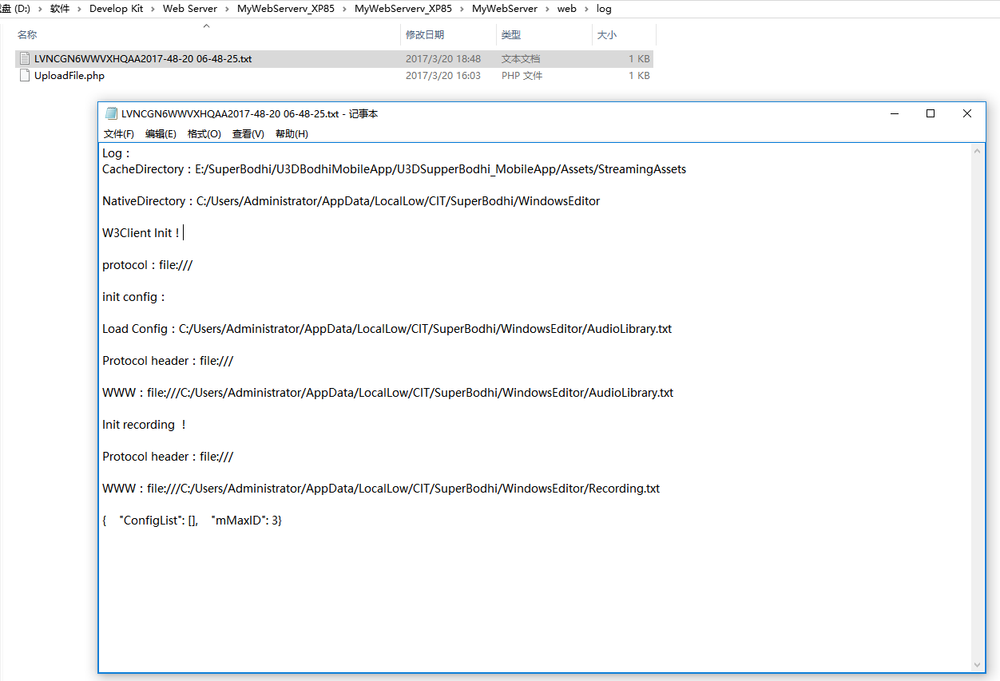

---
title: unity log日志上传至服务器
date: 2017-03-20 15:09:05
tags: [Unity]
---

 Unity开发中，经常需要拿到log日志，来帮助分析遇到的一些程序Bug。
 一般采用2种做法：
 一是将日志直接GUI显示在游戏运行时的左侧屏幕上，或者是用UGUI ScrollView显示日志信息。
 

 二是将日志保存到本地，然后从手机的文件中取出。

 但是有时候看着满屏幕的log或者在手机繁琐的文件目录中找来找去，比较烦；所以想找到一个简单的方法，将log日志上传到服务器中的一个固定目录下，方便随时查看出错日志。

 对于没有后端基础的开发者，<!--几乎是从零开始思考这个问题；-->当然希望能够采用最简单的方式实现。

 # 大致思路：
 运行中的游戏——将LogString Send到服务器——服务器接收数据(LogString)——将数据(String)保存至服务器上的一个文件txt中。

## 1 首先需要一台服务器。
 对于前端开发者来说，最大的问题肯定是如何搭建一台服务器出来？
 通常的服务器搭建可以选择IIS，Apache`阿帕奇`，tomcat`汤姆猫`等。考虑到并没有必要建立一个完善的服务器来运行，以及其中繁琐的设置过程。
 这里采用一个绿色免安装的微型Web服务器——[MyWebServer](http://cr173.com/soft/53598.html)。
 下载完成后，直接双击exe文件运行。

 

 > 注意1：
 MyWebServer的>高级设置>扩展映射>文件扩展名的映射模块：第一项 ".php"路径为"c:\php\php5isapi.dll"
 这里需要保证php压缩包被解压在c盘的相应目录。
 > 注意2：
 下载的php版本暂时不要超过5.2.x的版本，因为，“isapi方式建议使用PHP 5.2,因为5.3以上版不再提供ISAPI支持”。
 

## 2 需要将本地log信息上传。
 Unity中可以使用WWWForm提交Http请求。
 		
W3Client.cs 
```cs
	 // W3Client.cs

     public void Upload(string url, string content, string saveName, Action<WWW> callback = null)
    {
        this.StartCoroutine(this.IenumUpload(url, content, saveName, callback));
    }

    IEnumerator IenumUpload(string url, string content, string saveName, Action<WWW> callback = null)
    {
        Debug.Log(url + " " + content + " " + saveName);

        WWWForm form = new WWWForm();
        form.AddField("filename", saveName);
        form.AddBinaryData("content", Encoding.UTF8.GetBytes(content));
		
        WWW www = new WWW(url, form);
        while (!www.isDone)
            yield return www;

        if (callback != null)
            callback(www);
        Debug.Log(www.text);

        www.Dispose();
    }
 ```
> `其中，AddFiled 中的"filename"用于服务端来分析，PHP中使用$filename=$_POST['filename'];中取得。`
`AddBinaryData中的"content"用于服务器取得文件，PHP使用$content=file_get_contents($_FILES['content']['tmp_name']) ;file_get_contents取得文件内容。`

## 3 服务器端使用php来处理Http请求发来的内容。
 在MyWebServer的解压目录下，进入web目录。在目录下建立log文件夹，进行我们的相关操作。
 在log目录下，新建php文件：UploadFile.php。
UploadFile.php：```php
 <?php
$filename = $_POST['filename'];
$content = file_get_contents($_FILES['content']['tmp_name']);

$myfile = fopen($filename, "w") or die("Unable to open file!");
fwrite($myfile, $content);
fclose($myfile);

echo $content ;
?> 
```

## 4 调用
```cs
 string url = "http://192.168.0.100:80/log/UploadFile.php" ;
 string logInfo = "log test ; 2017/03/20 ; guojia" ;
 string fileName = SystemInfo.deviceName + System.DateTime.Now.ToString("yyyy-mm-dd hh-mm-ss") + ".txt"

 //Upload(url,content,saveFileName);
 W3Client.Instance.Upload(url, logInfo, fileName);
 ```
 最终效果：
 

> 
| 参考 |
| :-------- |
| 《[如何快速建立一个测试资源Web服务器及异步获取资源（Unity3D）](http://www.cnblogs.com/IlidanStormRage/p/6102279.html)  》|
| 《[Unity手机游戏开发 6.2.4上传下载图片](http://book.51cto.com/art/201410/453946.htm)》|
| 《[轻量级服务器软件:MyWebServer](http://cr173.com/soft/53598.html)》|
| 《[php教程](http://www.w3school.com.cn/php/php_file_create.asp)》|
| 相关推荐：Windows服务器开发环境搭建 |
| 《[关于如何在服务器上搭建tomcat并发布自己的web项目 ](http://blog.csdn.net/debugal/article/details/49330905)》|
|《[一键搭建最新php开发环境](http://jingyan.baidu.com/article/fcb5aff7a79531edaa4a713b.html)》|
|《[WEB服务器、应用程序服务器、HTTP服务器区别 ](http://www.cnblogs.com/zhaoyl/archive/2012/10/10/2718575.html)》|